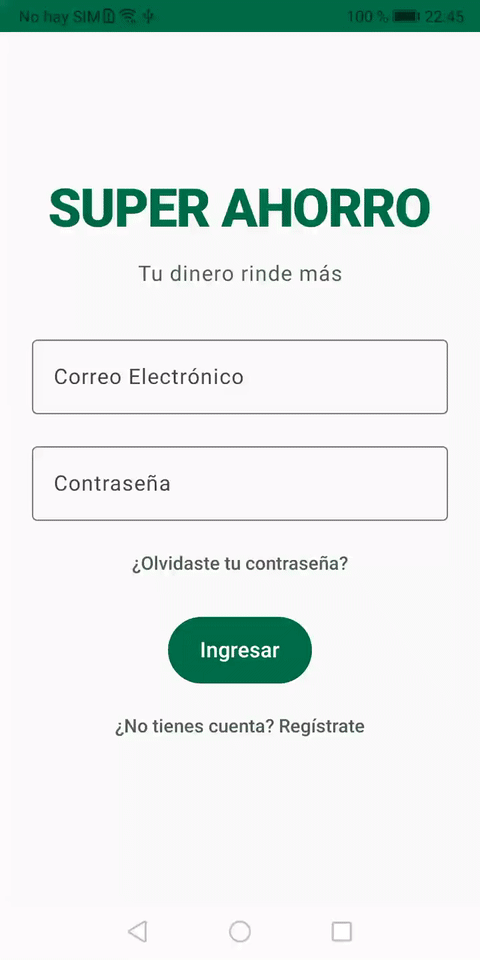

# 🛒 SuperAhorro

Aplicación Android para registrar, consultar y analizar gastos de supermercado, permitiendo llevar un mejor control de las compras y detectar oportunidades de ahorro.

> Trabajo Práctico Integrador — Tecnologías Móviles 2026 — IUA

---

## 📋 Descripción

**SuperAhorro** es una aplicación móvil Android desarrollada con Kotlin y Jetpack Compose que permite gestionar compras de supermercado de forma simple e intuitiva. El usuario puede registrar compras con sus productos, adjuntar fotos del ticket, consultar su historial, visualizar estadísticas de gasto y consultar precios de referencia desde una API externa en tiempo real.

---

## 📱 Pantallas

| Pantalla | Descripción |
|---|---|
| 🌟 Splash | Bienvenida inicial con routing automático según sesión activa |
| 🔐 Login | Autenticación contra usuario registrado en DataStore |
| 📝 Registro | Alta de nuevo usuario persistido en DataStore |
| 🔑 Olvidé mi contraseña | Recuperación de contraseña desde DataStore |
| 🏠 Home | Resumen de gastos, precios de referencia desde API y últimas compras |
| ➕ Nueva Compra | Registro de compra con productos del catálogo y foto del ticket |
| 📦 Nuevo Producto | Alta y gestión de productos en el catálogo (Room) |
| 🏪 Nuevo Supermercado | Alta, edición y eliminación de supermercados (Room) |
| 🔍 Detalle de Compra | Vista completa de una compra y sus productos |
| 📜 Historial | Historial completo de compras ordenado por fecha |
| 📊 Estadísticas | Gráficos y métricas de gasto |
| 👤 Mi Perfil | Edición de datos del usuario (nombre persistido en DataStore) |
| ⚙ Settings | Tema oscuro/claro y acceso a gestión de productos y supermercados |



---

## 🚀 Funcionalidades implementadas

- ✅ Registro e inicio de sesión con validación contra DataStore
- ✅ Sesión persistente entre cierres de app (routing automático en Splash)
- ✅ Tema oscuro/claro persistido en DataStore
- ✅ Registro de compras con fecha, hora y supermercado
- ✅ Catálogo de productos gestionable (agregar, editar, eliminar) persistido en Room
- ✅ Gestión completa de supermercados (agregar, editar, eliminar) persistido en Room
- ✅ Dropdowns de compra cargados en tiempo real desde Room
- ✅ Gestión de productos por compra (agregar, editar cantidad y precio, eliminar)
- ✅ Cálculo automático del total de la compra
- ✅ Adjuntar imagen del ticket desde galería o cámara
- ✅ Historial de compras
- ✅ Estadísticas de gasto
- ✅ Precios de referencia en tiempo real desde FakeStore API (Retrofit)
- ✅ Validaciones de formularios en todos los flujos
- ✅ Arquitectura MVVM con ViewModels compartidos

---

## 🛠 Tecnologías utilizadas

- **Lenguaje:** Kotlin
- **UI:** Jetpack Compose + Material 3
- **Navegación:** Navigation Compose
- **Arquitectura:** MVVM (Model - View - ViewModel)
- **Base de datos local:** Room (4 entidades: compras, detalles, catálogo, supermercados)
- **Preferencias:** DataStore Preferences (sesión, nombre, tema)
- **Networking:** Retrofit 2 + OkHttp + Gson (FakeStore API)
- **Imágenes:** Coil (`coil-compose`)
- **Cámara / Galería:** ActivityResultContracts
- **Íconos:** Material Icons Extended

---

## 📦 Estructura del proyecto

```
com.undef.superahorroniccolinibenitez/
├── model/
│   ├── Compra.kt
│   ├── Producto.kt
│   ├── CatalogoProducto.kt
│   ├── CatalogoData.kt
│   ├── Supermercado.kt
│   ├── SupermercadosData.kt
│   └── OfertaSupermercado.kt
├── ui/
│   ├── screens/
│   │   ├── SplashScreen.kt
│   │   ├── LoginScreen.kt
│   │   ├── RegistroScreen.kt
│   │   ├── OlvidarPasswordScreen.kt
│   │   ├── HomeScreen.kt
│   │   ├── HomeContent.kt
│   │   ├── NuevaCompraScreen.kt
│   │   ├── NuevoProductoScreen.kt
│   │   ├── NuevoSupermercadoScreen.kt
│   │   ├── DetalleCompraScreen.kt
│   │   ├── HistorialScreen.kt
│   │   ├── EstadisticasScreen.kt
│   │   ├── ProfileScreen.kt
│   │   └── SettingsScreen.kt
│   ├── components/
│   │   └── (componentes reutilizables)
│   └── viewmodel/
│       ├── HomeViewModel.kt
│       ├── LoginViewModel.kt
│       ├── RegistroViewModel.kt
│       ├── OlvidarPasswordViewModel.kt
│       ├── NuevaCompraViewModel.kt
│       ├── NuevoProductoViewModel.kt
│       ├── NuevoSupermercadoViewModel.kt
│       ├── OfertasViewModel.kt
│       └── SuperAhorroViewModel.kt
├── data/
│   ├── datastore/
│   │   ├── UserPreferences.kt
│   │   ├── SuperAhorroDatabase.kt
│   │   ├── local/
│   │   │   ├── dao/SuperAhorroDao.kt
│   │   │   ├── entities/
│   │   │   │   ├── CompraEntity.kt
│   │   │   │   ├── DetalleCompraEntity.kt
│   │   │   │   ├── CatalogoEntity.kt
│   │   │   │   └── SupermercadoEntity.kt
│   │   └── repository/SuperAhorroRepository.kt
│   └── network/
│       ├── RetrofitClient.kt
│       └── ofertas/
│           ├── OfertasApiService.kt
│           ├── OfertasRepository.kt
│           └── ofertaDto.kt
└── navigation/
    └── AppNavigation.kt
```

---

## 🌐 API externa

La sección **Precios de referencia** del Home consume la API pública de [FakeStore](https://fakestoreapi.com/):

| Campo | Detalle |
|---|---|
| Endpoint | `GET https://fakestoreapi.com/products?limit=6` |
| Librería | Retrofit 2 + Gson |
| DTO | `ProductoOfertaDto` (id, title, price, category, description, image) |
| Modelo UI | `OfertaSupermercado` (producto, descripcion, precio, url) |
| Categorías | Traducidas al español (`electronics` → Electrónica, etc.) |

---

## ⚙ Cómo correr el proyecto

### Requisitos previos
- Android Studio Hedgehog o superior
- JDK 11
- Android SDK 24+

### Pasos

1. Cloná el repositorio:
```bash
git clone https://github.com/Lauti00/SuperAhorro.git
```

2. Abrí el proyecto en **Android Studio**

3. Esperá a que Gradle sincronice las dependencias

4. Ejecutá en un emulador o dispositivo físico con **Android 7.0 (API 24)** o superior

> El emulador requiere conexión a internet para cargar los precios de referencia desde la API.

---

## 👥 Integrantes

| Nombre | GitHub |
|---|---|
| Lautaro Niccolini | [@Lauti00](https://github.com/Lauti00) |
| Emanuel Benitez | [@emanuelsimon](https://github.com/emanuelsimon) |

---

### Presentación

https://docs.google.com/presentation/d/1x4-1fdXucbfgfqi8DEMaaN7sYqyHnaU2/edit?usp=sharing&ouid=102515649760807253829&rtpof=true&sd=true

---

## 📄 Licencia

Proyecto académico IUA — Asignatura: Tecnologías Móviles 2026
